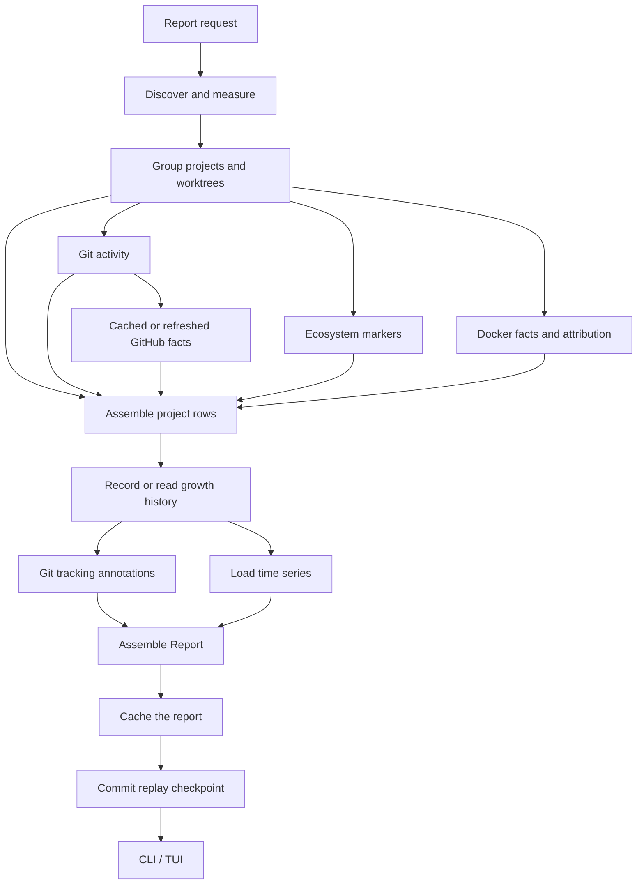

# Architecture

Swamp measures a development tree, attaches project context, and keeps observations for later comparison. Repeated use depends on three choices: retain enough state to reuse unchanged measurements, keep the history smaller than repeated full snapshots, and model the units a developer actually works with.

The CLI (interactive and its `--json` output for agent use) and TUI call the same report pipeline in `swamp-core`. This guide describes the implementation, including where work is still proportional to the full stored dataset.

## The data model

A report groups storage along these relationships:

| Entity | Identity and purpose |
|---|---|
| Project | Checkouts grouped by normalized `origin` remote; repositories without a remote fall back to their Git common-directory identity. |
| Checkout or linked worktree | A working directory and its Git context: branch, activity, tracking state, PR and merge facts. Worktree IDs are derived from paths. |
| Artifact | A classified unit such as build output, dependencies, cache, or Git metadata, attributed to the nearest containing worktree. |
| Directory or large file | Detail used for updates and growth inspection. Artifact interior directories are retained in storage but hidden behind the artifact row in the report. |
| Docker object | An image, volume, or build-cache record joined through explicit evidence, or reported as unowned. |
| Unowned row | Measured storage for which no project attribution was established, with a reason. |

Project grouping is implemented in [projects.rs](../crates/core/src/consumers/projects.rs). A linked worktree resolves its shared Git directory; a submodule resolves its own repository. Different clones with the same normalized remote share a project in the report. This is URL normalization, not server-side alias resolution: changing a remote URL or moving a worktree can change identity and split its history.

### Classification supplies context

The [ecosystem table](../crates/core/src/ecosystem.rs) associates markers such as `Cargo.toml` and `package.json` with artifact names. Ambiguous names such as `build`, `dist`, and `vendor` require a matching marker in their parent directory. Some names are recognized without a marker. A valid `CACHEDIR.TAG` also identifies a cache.

Classification supplies an artifact kind and ecosystem. It does not prove that everything inside a build directory is reproducible. The [harvest utility](../crates/harvest/src/main.rs) compares the table with vendored ignore and language lists; it reports candidates without editing the table. An ignore rule alone says nothing about whether the contents can be recreated.

Cargo reports retain profiles, role directories, individual incremental/build-script groups, identified test/example executables, and final executables/libraries directly inside each profile. Group sizes come from existing folded directory measurements; selected output files use shallow metadata reads. Cargo annotation does not recursively walk the build tree again. IDs are scoped to the canonical storage container, independently of project ownership. Trusted event coverage lets unchanged containers reuse these units. Only these units receive nested history; ordinary compiler files do not become report or history rows. Nested history does not inflate project totals. The small report cache is compressed; measurements and reverse deltas remain in Parquet. Dependencies remain a folded directory aggregate, not a per-crate size breakdown. Final outputs are currently inspection-only.

Folded groups show allocated totals, not an inferred reclaimable size. Subgroup hardlink attribution is unknown and displayed as such. Internal files can be inspected explicitly, but their past identities are not retained after deletion. This is a developer storage tool, not a filesystem audit log.

Path layout identifies profiles, dependencies, examples, build-script output, incremental state, and companion metadata. Existing Cargo fingerprints identify test executables and supply feature/compiler evidence where available. A fingerprint is not proof of last execution or obsolescence. Unknown variants stay unknown; historical compiler-message evidence does not establish freshness. Scanning never runs Cargo or build scripts.

Selective cleanup uses the existing plan, explicit approval, and ledger boundary. Supported selections are evidenced test/example executables with their dep-info/debug-symbol companions, or individual incremental/build-script directories. Execution holds existing Cargo profile locks and rechecks the selected group's role, fingerprint evidence, membership, identity, content, and occupancy—not the whole build tree. It then moves members into a same-filesystem Trash envelope with a restore manifest. Hardlinks do not prevent that move: unselected links remain intact, and reclaimable space stays unknown. The selected-group snapshot records link evidence without building a global alias inventory. Unsupported layouts, missing locks, and uncertain occupancy refuse cleanup. Locks are advisory: manual writers must be stopped. Shared dependency groups remain inspection-only.

Files outside classified artifacts are split into tracked, ignored, and untracked remainder buckets. The [ignore lens](../crates/core/src/ignore.rs) uses Git's index and exclude rules through gitoxide. Byte totals are apportioned using directory observations, with corrections for individually recorded large files. This preserves the measured total but is not an exhaustive per-file accounting of Git status.

### Attribution and recovery are separate

An image's source label or Compose metadata can associate it with a project even though it is stored by Docker. Similar names alone do not establish ownership. An unmatched object stays unowned.

Filesystem reconciliation separates attributed and unowned bytes. Docker has separate attributed and unowned totals, because daemon storage and shared layers do not map directly to the walked tree. The optional `--verify-du` result is an independent comparison; it does not establish that an entire volume, snapshots, or inaccessible paths have been accounted for.

## Cross-ecosystem decision contract (planned extension)

The reusable decision aid is **age + size + removal consequences**. Cargo currently supplies this guidance; the other ecosystem adapters remain planned under [#74](https://github.com/open-horizon-labs/swamp/issues/74). This is not a claim of implemented cross-ecosystem parity.

Modification age is enough to recommend reviewing a supported generated-output or cache unit. It is not proof of obsolescence, and access time is not a prerequisite. Recent units remain reviewable; unknown or future timestamps must not look ancient. Unique data and active writers still require their specific protections. A recommendation never supplies deletion authority.

The responsibilities are separate:

| Layer | Contract |
|---|---|
| Identification and adapters ([#64](https://github.com/open-horizon-labs/swamp/issues/64), #66–#71) | Identify domain units, roles and membership independently of cleanup. Supply size/accounting basis, source-qualified timestamp and coverage, concrete removal consequences and prerequisites, and supported action granularity. Do not infer recoverability from names alone. |
| Aggregation ([#65](https://github.com/open-horizon-labs/swamp/issues/65)) | Summarize nonempty supported candidates: count, bytes on a common accounting basis, oldest known candidate modification time. Stop at an included removal group rather than counting its descendants again. Preserve unknowns and residuals; never label the oldest child timestamp as the category's last use. |
| Storage and incremental observation (#65, [#53](https://github.com/open-horizon-labs/swamp/issues/53)) | Reuse folded measurements, event invalidation, existing consumers and current + reverse-delta Parquet history. Retain compact unit-level measurements and source timestamps; derive age when displaying. Evidence refresh and passing time do not create byte-history deltas. No parallel database, exhaustive per-file index or giant artifact JSON cache. |
| Presentation and action ([#72](https://github.com/open-horizon-labs/swamp/issues/72), [#73](https://github.com/open-horizon-labs/swamp/issues/73)) | Show candidates and consequences in ordinary drill-down, including collapsed summaries. Rank older known candidates first, then size, with unknown age last. Exact selection, live checks and approval remain separate from read-only advice. |

Folded-group timestamp semantics must describe what was observed; a directory's own mtime does not establish every descendant's activity. Optional native last-use evidence remains separately labeled. Deeper attribution or membership inspection is bounded and on demand, not a second recursive walk on every refresh. Exact cleanup checks inspect only the selected groups. Allocated size is not a promise of freed space, and uncertain hardlink reclamation alone is not a reason to reject removal.

The planned validation covers mixed/unknown ages, overlapping groups, non-additive accounting, concrete consequences, evidence-only refresh, and unchanged/one-group-change latency and storage size. The purpose is useful developer cleanup decisions, not a perfect audit of historical use.

## Observation pipeline

Each consumer subscribes to typed events and returns follow-on events. Registration happens in [EventBus::with_builtins](../crates/core/src/bus/mod.rs) before the run begins. Large shared event payloads use `Arc`.

The assembly gate waits for local signals, GitHub results, ecosystem tags, and Docker results. Unavailable enrichment produces unknown facts or notes so the rest of the report can still be built. After growth annotation, tracking and time-series consumers run as sibling subscribers; the final assembler waits for both.

The walk stages its replay checkpoint. Observing runs publish it only after history and report-cache writes succeed. A later consumer or cache failure leaves the prior replay anchor in place so the next run can retry that interval. This ordering is not a transaction across the legacy history tables; already-written tables may need reconciliation after a failed run.

The bus uses a Tokio current-thread runtime and `join_all` for subscribers of one event. Follow-on events are dispatched depth-first in registration order. An `async` consumer is not automatically nonblocking: several call synchronous filesystem and subprocess code. Filesystem traversal and some enrichment work have their own concurrency. The bus's main benefit is explicit dependencies and separate stages, not a guarantee of parallel execution.

See [ADR 001](ADRs/001-event-bus-report-pipeline.md) for the decision and [consumers](../crates/core/src/consumers/) for the stages.

## Incremental observation

### Establish a baseline

The initial observation discovers repositories and measures allocated filesystem bytes. The [walker](../crates/core/src/walk.rs) uses a worker pool, stays on the root's device, avoids following symlinks, and deduplicates hardlinked files by device and inode.

Folding an artifact means grouping its bytes under one report row. The walker still traverses that directory to measure it. During the walk it also records interior directory rows for later updates.

### Ask macOS where to look next

Subsequent observations use the stored FSEvents ID and device to request changes under the root. Events identify areas to remeasure; they do not supply byte deltas or the process that caused a change.

An observation with usable event history reconstructs the previous topology and attribution, applies changes, and carries untouched rows forward. The work depends on the change:

| Change | Work performed |
|---|---|
| Existing remainder directory changes | Re-list that directory and update its stored totals when the stored structure permits it. |
| Directory inside an artifact changes | Re-list affected interior directories and update allocated totals. Wide directories use bounded batches on the existing worker pool. |
| Changed artifact has hardlinks | Keep its last unique-byte measurement, mark it stale, and update directory allocations without traversing unchanged interiors. |
| Interior detail is unavailable | Resize the whole artifact. |
| New or structurally changed subtree | Discover repositories or artifacts and perform the broader walk needed to rebuild attribution. |
| Event history is incomplete or cannot be trusted | Perform a full walk and report the reason. |

Hardlinks do not force a whole-target walk when interior measurements are available. `allocated_bytes` and `allocated_growth_bytes` describe current path allocations, which may count a linked inode more than once. `bytes` and `local_bytes` retain their last deduplicated measurements; `dedup_stale` distinguishes those from current measurements. CLI/TUI warn when unique-byte totals are stale. Unique-byte growth is unavailable and its history has a gap while stale, rather than inventing zero growth. A full scan reconciles the counts. Cleanup still checks its actual selected members; allocated size is not promised reclaimable space.

Plans warn about stale unique-byte estimates, and standing grants cannot spend a budget against them. A human may explicitly approve a plan with that warning. A scoped Cargo cleanup measures its selected members freshly and still requires per-plan approval.

The fallback reasons include a missing or future event ID, a device mismatch, dropped or inconclusive events, too many changed directories, and changed classification rules. A replay too soon after the previous observation also falls back, because the persisted event log can lag writes. `--full` explicitly forces a full walk.

Apple documents event coalescing and rescan requirements in its [FSEvents flags reference](https://developer.apple.com/documentation/coreservices/1455361-fseventstreameventflags/kfseventstreameventflagmustscansubdirs). Swamp's handling is in [fs_events.rs](../crates/core/src/fs_events.rs) and [growth.rs](../crates/core/src/growth.rs). The [incremental tests](../crates/core/tests/fsevents_incremental.rs) compare representative changes with full walks, including nested worktrees and shared hardlinks.

### Keep the interface responsive

The TUI opens a cached report when one exists, then observes on a background thread. While open, it receives live FSEvents and waits for 400 ms of quiet before observing the affected directories. Live events bypass the replay-lag floor. The first run, without a cached report, must wait for its initial observation.

The optional LaunchAgent starts `swamp observe` at an interval and lets it exit. It keeps observations accumulating when no UI is open. It is not a permanent swamp daemon.

## History storage

### Current values and reverse deltas

The report history lives under `~/.local/share/swamp/<root-scope-id>/`, or the directory selected by `SWAMP_DIR`. The scope ID hashes the device and canonical scan root. Current measurements, reverse deltas, topology, and event checkpoints are isolated by root, so a project observation cannot replace its parent's state. Root aliases share a scope. GitHub enrichment remains a separate device-scoped cache keyed by worktree and Git evidence.

| Stored data | Purpose |
|---|---|
| Artifact current rows and reverse deltas | Bytes, presence, previous values, and regrowth counts |
| Directory current rows and reverse deltas | Own and rolled-up bytes, counts, completeness, and modification time |
| Large-file current rows and reverse deltas | Allocated bytes and modification time for files above the configured threshold |
| Topology and FSEvents state | Worktree locations and the event cursor needed to reuse observations |
| GitHub enrichment | Cached remote facts, separate from filesystem measurements |
| Last report JSON | Data the UI can display before the next observation finishes |

The implementation is in [growth.rs](../crates/core/src/growth.rs); the older `store.rs` supports the separate `scan` command and is not the report-history implementation.

A reverse delta stores a changed row's previous value. As an illustrative sequence:

| Observation | Current size | Previous value saved |
|---|---|---|
| First observation | 1 GB | None; no earlier measurement exists |
| Artifact grows | 3 GB | 1 GB and its observation time |
| Artifact shrinks | 2 GB | 3 GB and its observation time |
| Size stays the same | 2 GB | No new byte-history value |

The current rows and retained previous values form a time series. Growth is today's measured size minus the historical value nearest the requested baseline time. It is a comparison of observations, not an exact measurement at every intervening instant.

Artifact disappearance produces a tombstone; a later reappearance increments a regrowth count. That records presence transitions. It cannot establish that a particular tool or cleanup caused them.

### What keeps the store smaller

Artifact histories use a key containing project ID, worktree ID, kind, and worktree-relative path. Directory rollups avoid indexing every small file separately. Files at least 1 MiB get individual rows by default; the threshold is configurable. Directory and file modification times are stored as 32-bit minute values.

Parquet groups fields into columns and zstd compresses the stored batches. A size/presence change saves the old artifact value; an unchanged observation need not add a delta. Metadata changes can still cause directory or file writes. When a current dataset changes, that current Parquet file is rewritten: this is not an in-place row-update store.

History lookup builds an index from retained rows once for growth annotation, rather than reloading the files for every artifact. Delta compaction starts above 20 files, or at eight files when their combined size is at most 128 KiB. The earlier trigger amortizes repeated Parquet headers and footers in small observations. Compaction groups retained rows by identity and time without discarding their fields, and drops records outside the retention window. Default retention is 30 days; physical pruning happens during maintenance, not at a precise wall-clock deadline.

The history writer closes and syncs each temporary Parquet file before publishing it, so ordinary readers do not see an unfinished footer. Compaction publishes its replacement before removing input files; publication failure leaves the inputs intact. This is per-file replacement, not a transaction across all history files or a guarantee against every crash or concurrent-writer failure. Interruption during input retirement can leave duplicate historical rows.

### What history can answer

The UI and growth-oriented `--json` responses (`report --view grown`) expose the available history window. A newly discovered artifact has no earlier baseline. Unobserved periods are not evidence of zero activity, and a file that grows and shrinks between observations may leave no net change.

Retained size history helps locate recurring growth and compare periods without traversing the filesystem separately for each baseline. It is not a backup or a forensic log of every write.

## Enrichment and freshness

Enrichment gives measured bytes context for a decision. Its freshness differs by source:

| Source | Collection and reuse |
|---|---|
| Local Git | Activity, branch, dirty status, unpushed count, and locks. Unchanged worktrees can reuse previous signals with ages advanced. |
| Ecosystems | Markers and the shared classification table attach project types and artifact provenance. |
| GitHub | `gh` queries coalesce branches per repository. Cache validity includes the worktree tip SHA and a six-hour TTL. |
| Docker | Daemon facts are cached for five minutes; an enrichment run requests fresh facts. |
| Git tracking | gitoxide reads the index and ignore rules; the exclude stack is reused for path queries within a checkout. |

Plain `report` reads cached GitHub information. `observe` and `report --enrich` allow refreshes, subject to the cache policy and query budgets. Missing credentials, unknown facts, and query failures remain visible. Docker may still be queried by a normal report when its cache expires.

Merge status is combined with clean/unpushed terms in `merge-complete`; it is evidence a user can inspect, not a permission to delete. The current `tip_reachable` term is derived from the merged result rather than a separate reachability proof.

## Actions and extension points

A report supplies the context for a plan. CLI `propose` plans (whether run interactively or via `--json` by an agent) carry selected units, observations, recovery information, and warnings. Approval supplies a one-shot grant or execution uses a matching standing grant. Execution records outcomes and recovery locations in a ledger. TUI confirmation creates its own short-lived plan and grant and uses core execution primitives.

These action paths share concepts and lower-level code but do not have identical validation. Do not infer a universal guarantee from a check present in only one path. Docker removal is delegated to the daemon; filesystem moves go to Trash. Grant-writing (`swamp approve`, `swamp grant add`) is reserved by convention for a human to invoke, but a shell-capable agent still has the operating-system permissions of its account and could invoke those same commands -- see `skills/swamp/references/trust-model.md` and `.oh/guardrails/human-only-authorization.md` for what actually enforces safety at the sink.

To add a fact source, implement a consumer and register it before dispatch. If it introduces a new event payload or report field, also update the event definitions, assembly gate or final assembler, serialization, and relevant interfaces. Registration alone is sufficient only when the existing contracts already express the new fact.

To add artifact recognition, update the ecosystem rules and fixtures. Classification changes must invalidate old observations through the rules version. An upstream ignore entry is research input; inspect what a directory can contain before classifying it.

## Limits of the current implementation

- Incremental filesystem work can be local, but report reconstruction, history reads, and changed current-file writes can still scale with the stored dataset.
- Worktree identity is path-derived. Relative artifact paths do not make history portable across arbitrary moves or renamed remotes.
- Growth filters use the report's precomputed values. A filter's window does not trigger a new baseline calculation; the TUI can display a filter window different from the configured report window. Use explicit CLI `--since` values for window comparisons.
- Overlapping scan roots have independent histories. Their totals must not be added together; scanning both also retains measurements for both scopes.
- Filesystem events may require a full scan. Hardlinks can make an artifact update much more expensive than the changed directory alone suggests.
- The report covers what swamp measured under the requested root. It is not a complete accounting of volume free space, snapshots, backups, or Docker's physical storage.
- GitHub and Docker context can lag local measurements. Check observation times and notes before acting.

The [accuracy report](accuracy.md) records the source checks behind these descriptions. Historical timings in the [changelog](../CHANGELOG.md) are individual observations; representative benchmarks are still needed for latency and storage-size claims.
