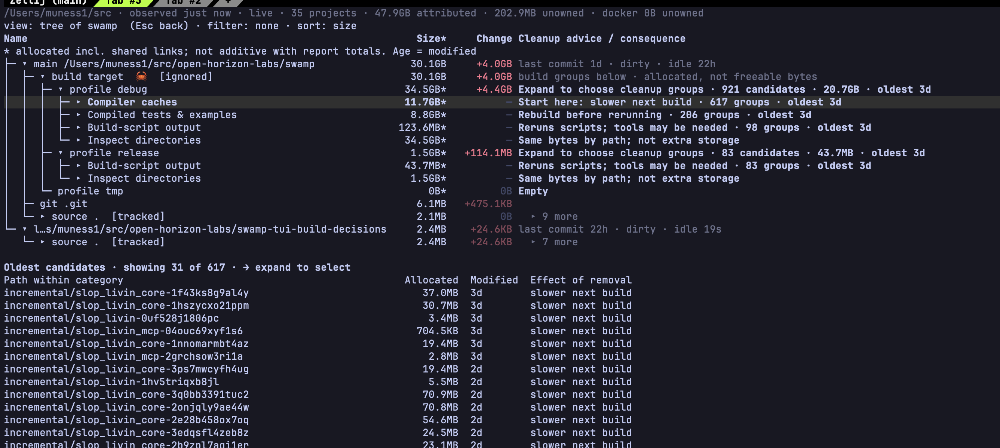

# Usage

For the product overview, start with the [README](../README.md).

## Installing a release

On Apple silicon macOS, install with [Homebrew](https://brew.sh). The formula installs the `swamp` binary, the `skills/swamp/` agent skill, and verifies the release archive's checksum:

```bash
brew install open-horizon-labs/tap/swamp
swamp --version
```

Update with `brew upgrade swamp`; uninstall with `brew uninstall swamp`.
The tap checks for new releases every 15 minutes; GitHub may delay scheduled updates.

If you installed manually before, run `type -a swamp`. A copy in
`~/.local/bin` may take precedence over Homebrew. Remove that manually installed
copy after verifying `"$(brew --prefix)/bin/swamp" --version`.

Release archives remain available on the [releases page](https://github.com/open-horizon-labs/swamp/releases).
You can also [build from source](../README.md#build-from-source).

## Observations and history

```bash
swamp report ~/src --since 24h
swamp report ~/src --since 7d --sort size --reverse
swamp observe ~/src
swamp schedule --every 15m ~/src
swamp schedule
swamp schedule --off
```

`report` measures and persists by default. `observe` records data without rendering and permits GitHub enrichment. Scheduling runs that observation command; it does not delete anything.

History starts when swamp observes a root. `--since` selects a comparison window, defaulting to the `since` config value. Use seconds, minutes, hours, or days here: `30m`, `24h`, `7d`. The filter language also accepts weeks, but the CLI/config history-duration parser does not; use `7d` rather than `1w` for `--since`.

`report --no-observe` skips persisting a new growth observation. It can still inspect the filesystem and consult enrichment caches; it is not a command for reading only cached JSON. The TUI's `--no-observe` uses its last cached report when one is available and disables the live watch.

Use `--full` to force a full filesystem walk. A normal observation can also fall back to a full walk when event history is insufficient; the report notes explain why.

Observations are stored separately for each canonical scan root. You can switch between a project and its parent directory using the same `SWAMP_DIR`; each root keeps its own history and incremental checkpoint. Overlapping roots are separate views, not totals to add together.

## Scope and coverage

`report`, `observe`, `ui`, and `schedule` all take an explicit root. Omit
it and they resolve the same **effective scope**, computed by one shared
function so no command can silently disagree with another:

```bash
swamp scope
swamp scope --json
```

The effective scope is built from four sources, in this order:

1. **Built-in default roots** on macOS: `~/src`, `~/Library/Developer`,
   `~/Library/Caches`. (Linux has no built-in defaults yet.)
2. **Detector results.** A built-in catalog of read-only detectors
   proposes locations for developer tools: language version managers
   (mise, asdf, pyenv, uv, Conda, rbenv, RVM, ruby-install, nvm,
   rustup), shared dependency/build caches (Cargo home, npm, pnpm,
   Gradle, Maven, Go, pip), Apple/Android developer tooling (Xcode,
   CoreSimulator, Android SDK), and package/model/VM stores (Homebrew,
   Hugging Face, Ollama, Docker Desktop's host backing file, OrbStack).
   A conventional path is still proposed even when the tool's
   executable is absent, so a leftover cache can still be found. See
   [docs/locations.md](locations.md) for the full table -- every
   detector, its locations, overrides, categories, and documented
   limits (e.g. pnpm's per-volume stores are not enumerated, Maven's
   downloaded-vs-locally-installed split needs per-artifact evidence
   this catalog does not inspect). `swamp scope --json` always lists
   the exact detector IDs and catalog version in use.

   A detector-resolved location that falls *inside* another kept root
   (a config `include`, a built-in default, or another detector's own
   base directory) is pruned from that root's walk and measured
   exactly once, as its own external unit -- see
   [coverage-and-history.md](../skills/swamp/references/coverage-and-history.md)'s
   "External/shared storage units".
3. **`[scan] include`** in `config.toml`: extra roots always in scope.
4. **`exclude`** and **`disabled_detectors`**: pruned last, and always
   win over every other source -- including an explicit root you pass
   on the command line. Disabling a detector does not hide a path
   reachable through another still-enabled root (e.g. disabling the
   Cargo detector does not hide `~/.cargo` if it happens to live inside
   `~/src`, which is still in scope via the built-in defaults).

`[scan] defaults = false` means **explicit-only scope**: swamp infers
nothing. In scope are your `include` entries, any explicit command
root, and detectors your config actually names -- either through the
`enabled_detectors` allow-list, or (equivalently) as the complement of a
non-empty `disabled_detectors` deny-list. With `defaults = false` and
neither list set, **nothing** is in scope and every command says so.

```toml
[scan]
defaults = false                     # infer nothing
include = ["~/code"]                 # ...except this
enabled_detectors = ["huggingface"]  # ...and this one detector
```

An earlier release read `defaults = false` as "drop the three built-in
default roots, keep inferring from every other detector", which put
paths in scope that nothing in the config had asked for. That reading is
gone.

The two lists are read differently, and it is worth being precise about
which, because "explicit" can mean either:

- **`enabled_detectors` is an allow-list.** When it is non-empty, only
  the detectors it names run. Adding a detector to the catalog later
  changes nothing for you.
- **`disabled_detectors` is a deny-list**, even under
  `defaults = false`: the catalog *minus* the ones you named. So
  `defaults = false` with only `disabled_detectors = ["homebrew"]` runs
  every other detector -- naming what you do not want is itself an
  explicit statement about the rest.

Both readings are pinned by name:
`scope.rs::tests::defaults_false_without_includes_or_enabled_detectors_is_empty`
(neither list set means empty),
`defaults_false_with_only_disabled_detectors_still_runs_the_rest` (the
deny-list reading), and the reviewer's own
`defaults_false_must_mean_explicit_only`. If you want the strict
reading, set `enabled_detectors` rather than relying on
`disabled_detectors`.

Passing an explicit root (`swamp report ~/other-tree`) replaces sources
1-3 entirely for that invocation -- `exclude` still applies. A root that
sits inside another in-scope root is folded into its parent for
measurement (not walked twice); `swamp scope --json` still lists it,
marked `skipped-as-nested`, so you can see exactly why it did not get
its own line.

An effective scope that resolves to nothing at all -- `defaults =
false` with no `include` and no enabled detectors -- is a visible error,
never a silent fallback to the current directory or your home
directory. Malformed `[scan]` config (e.g. `defaults = "yes"` instead
of a bool) is also a visible, nonzero-exit error rather than a silently
broadened scope.

### Keeping things: `swamp protect`

`swamp protect add <path>` records that you want a path kept. It blocks
in **both** directions:

- anything at or beneath a protected path is never proposed or removed; and
- anything that *contains* a protected path is never proposed or removed
  either. Protecting `~/.claude/debug/log.txt` therefore also stops
  `~/.claude/debug/` being removed, because removing the parent would
  destroy exactly what you asked to keep.

Protection is re-read from disk at the moment an action executes, not
captured when the plan was proposed: adding a protection after approving
a plan stops that plan. If the protect list cannot be read or parsed,
protection state is **unknown**, and every action refuses with that
reason until the file is repaired or removed -- `swamp protect list`
reports the same error rather than printing an empty list. The file is
written atomically (temp file plus rename), so an interrupted write
cannot turn your keep list into an empty one.

Coverage is not storage: adding a root, excluding one, or a detector
newly resolving a path is a change in what swamp *looks at*, not a
change in what exists on disk. `report`/`observe` persist the resolved
scope (`scope.json` under `SWAMP_DIR`) and print a one-line note on
stderr when it changes since the last observation, e.g. `coverage
changed since last observation: +root /Users/you/.cargo (detector
cargo-home), -root /Users/you/old-project (excluded)`. This note never
implies bytes were added or removed -- see
[coverage and history](../skills/swamp/references/coverage-and-history.md).

With no explicit root, `report`, `observe`, and `ui` all now observe
the **whole** effective scope coherently in one call
(`swamp_core::report::report_scope`), not just its first present root:
every present root is walked, every root's growth store is written
(each root still keeps its own physical current+reverse-delta store,
keyed by device and canonical path -- this is one coherent
orchestration, never a merged store, so one root's observation can
never overwrite or corrupt another's), and the resulting `report --json`
carries a per-root `scope_coverage` array whenever any root is not
fully, cleanly observed. Passing an explicit root still replaces the
scope entirely and stays on the single-root path, same as always. A
scheduled run installed with no explicit roots (`swamp schedule --every
30m`, no trailing paths) re-resolves the configured scope on every
fire, so editing `config.toml` takes effect on the next run rather than
only after re-running `schedule --every`.

`swamp ui` with no explicit root opens over this same whole scope, not
just its first present root: project, shared/external, and agent-tool
storage from every present root are all visible together, including a
root that has no Git checkout in it at all. The header shows a short
coverage clause whenever any root's own walk this pass was not cleanly
`complete` (e.g. `2 roots (1 missing)`, `2 roots (1 partial: 2 path(s)
unreadable during this walk)`); the live FSEvents watch and the
cached-startup/background refresh both cover every included root
independently, so a change under one root is reflected without ever
touching another root's rows. Passing an explicit root
(`swamp ui ~/other-tree`) keeps the single-root path unchanged.

### Observation regions

Every root `report`/`observe`/`ui` considers gets one of five outcomes
for that pass, visible in `scope_coverage`/`swamp scope`:

- **complete** -- walked in full; its growth store is authoritative.
- **partial** -- walked, but part of it (a subdirectory, a worktree)
  could not be read this pass; that part's rows are left untouched
  rather than tombstoned.
- **excluded** -- pruned by a config `exclude` entry, either the whole
  root or a subtree inside an otherwise-included root. Not observed,
  never treated as deleted.
- **missing** -- the root does not currently exist. Its previously
  observed rows (if any) keep their history untouched.
- **inaccessible** -- the root exists but could not be read at all
  (e.g. `chmod 000`, or access lost between scope resolution and the
  walk). No walk is attempted; the store is completely untouched and no
  FSEvents cursor advances for it.

A root that only *lost read access* (still exists, cannot be listed) is
distinguished from one that is genuinely gone: losing and regaining
access to an unchanged tree never fabricates a deletion or a later
regrowth. Removing a root from scope, or adding an exclusion, is
likewise a coverage change, never a storage change -- see
[coverage and history](../skills/swamp/references/coverage-and-history.md).

The TUI header shows a short coverage clause when its own root is not
simply present (e.g. `2 roots (1 missing)`), dropped first among
trailing clauses on a narrow terminal like every other low-priority
header fact -- never silently hidden. This reflects the *resolved*
scope for the one root `swamp ui` was given (`scope::RootStatus`, no
walk required), not the richer per-root walk outcome above
(`coverage::RegionStatus`) that `report --json`'s `scope_coverage`
shows; making the TUI's own report itself multi-root is tracked
separately (#50).

## External and shared storage

Storage with no containing project -- the Cargo registry, rustup
toolchains, a Homebrew prefix, and future detector-resolved locations
(model stores, package caches, ...) -- is measured as a first-class
**external unit**, independent of any project or worktree:

```bash
swamp report --view external
swamp report --view external --json
```

Each unit's identity is `(detector, category, canonical path)`; size,
growth and regrowth history live in the same current+reverse-delta
growth store as everything else (a new key family, not a second
store), so the same retention/coverage guarantees apply. Categories
(`installation`, `downloads`, `cache`, `local-state`, `environments`,
`build-output`, `models`, `unclassified`) come from the detector
registry that also resolves scope (#44) -- an entire manager home is
never collapsed into "cache", and a unit is measured whether or not any
project currently references it (removing the last consumer never
deletes the unit or its history).

External units are **inspection-only**: `actions::propose_external`/
`unit_from_external` can build a plan naming one for review, and
`swamp execute` refuses every such unit unconditionally with "no
supported selective action for `<category>`" -- registry/detector
output identifies storage, it never authorizes removing it. `swamp
propose`'s CLI does not yet expose a `--external` selection mode (it
still expects a walked report root); today this plan/refusal contract
is reachable through the core API and is exercised end to end by
`crates/core/tests/external_units_actions.rs`, not yet through a
dedicated CLI flag. The `--view
external` total is deliberately kept separate from `reconciliation`
above it: external units are never folded into `walked_total`/
`attributed`/`unowned`, so there is nothing to double-count, but the two
bases (a walked root vs. a detector-resolved location) are different
enough that summing them would be misleading.

The TUI has a dedicated, read-only External view (`v`/`9`): the same
one-row-per-unit facts as `--view external`, never markable (the same
"execute refuses every one unconditionally" contract applies; the TUI
never offers a delete affordance the action layer would refuse anyway).

## Agent-tool storage

Coding-agent tools (Claude Code, Codex, its desktop app, Oh My Pi,
OpenCode, Gemini CLI, Pi, Aider, GitHub Copilot CLI, Cursor, Windsurf,
Cline, Roo Code, Continue -- every tool in the required matrix now has
real identification code) keep session
transcripts, caches, logs, checkpoints and
configuration under their own home directory. `swamp` identifies that
storage the same way it identifies external storage above -- the home
directory itself is one external unit -- and additionally classifies
its *interior* into finer-grained units (sessions, caches, logs,
checkpoints, protected config, ...), each with its own size/growth
history and, where evidence supports it, a link to the swamp project a
session's `cwd` names:

```bash
swamp report --view agents
swamp report --view agents --project my-repo
swamp report --view agents --json
```

Read `docs/agent-storage.md` for the full category/linkage/privacy
contract and the required tool matrix (which tools are identified
today vs. named-and-planned). In short:

- **Privacy is a hard contract.** Identification reads directory names,
  file sizes/mtimes, and -- for a session's project linkage -- only the
  first line of its transcript file, looking for a `cwd` field. No
  prompt, response, attachment or credential content is ever read into
  a report, a plan, the ledger, or a log.
- **Categories carry different consequences.** Cache/log categories
  (`shell-snapshots`, `debug`, plugin/skill `.trash`) are regenerated
  automatically and are, with the legacy directories below, the only
  categories with a supported action this release. A few directories are
  neither: Claude Code's `statsig/`, `logs/` and unmatched `todos/`
  entries are documented upstream as legacy and **no longer written**, so
  removing them costs nothing and nothing comes back. Removing a session
  means losing its resume/rewind/checkpoint history -- the linked
  project's own files are never touched. Credentials, settings, skills, commands and
  similar automation definitions are protected by default and have no
  supported action at all.
- **A tool whose layout is not confirmed against its own source gets
  identification and nothing else.** `swamp report --view agents` still
  measures Cursor's and Windsurf's storage, but offers no action and
  reports linkage as unresolved, because acting on a layout nobody has
  verified is not a size question. The same now applies, narrowly, to
  GitHub Copilot CLI's `session-state/`: the *directory names* are
  documented by GitHub, what is inside them is not, so those units are
  measured and never proposed. `docs/agent-storage.md`'s matrix says
  which is which, and every "supported" row's citation is pinned to an
  upstream commit and checked by CI.
- **Human keep/protect intent survives refresh:**
  `swamp protect add <path>` / `swamp protect list [--json]` /
  `swamp protect remove <path>` -- independent of, and never overridden
  by, anything observation infers.
- **Supported actions:** `swamp propose --path <unit-path> [--json]`
  (no `root`) builds a real plan (or a named refusal) for a selected
  unit, then the same `swamp approve <plan-id>` / `swamp execute
  <plan-id>` every other plan uses. `swamp propose` is the one entry
  point for every proposal kind: with no `root`, a `--path` routes
  automatically to the agent-storage proposer or the external-unit
  proposer (`--external` forces the latter, inspection-only route
  explicitly); only a filesystem artifact/Cargo-group/worktree needs a
  `root`. `swamp propose-agents --path <unit-path>` still works too, as
  a deprecated alias into the identical code path. Nothing wider than
  the exact selected unit is ever affected; occupancy, references and
  identity are all re-checked at execution, not assumed from the plan.
  A session removal that partially fails (some members moved, then a
  later one could not be) leaves a `restore.json` recovery manifest
  inside its Trash envelope, and the execute result names the envelope
  and the bytes that really did move.
- **Project-linked view:** `swamp report --project <name>` (text or
  `--json`, no `--view` needed) includes this project's own linked
  agent storage -- a collapsed "Agent storage (linked)" summary row per
  contributing tool in the text tree, and an `agent_storage: {units,
  total_bytes}` object in JSON.

The TUI has a dedicated Agents view (`v`, no digit -- `0` is "clear
filter"): the same per-unit facts as `--view agents`. `Space`/
`Backspace` mark the selected unit and open the confirm banner showing
its real consequences (session-removal loss warnings, the linked
project); `Enter` executes through the same background-worker path
every other TUI deletion uses -- never blocking the event/render
thread. A protected or unsupported row cannot be marked; the footer
names the exact reason. Bulk marking (`Shift+A`) reaches the Agents
view too: it marks every actionable row on screen the same way,
skipping protected/unsupported/active ones and naming the skip in the
footer. The project tree's own Tree view also shows the collapsed
"Agent storage (linked)" summary row (informational; marking a specific
unit still happens in the Agents view).

## Cleanup recommendations

Age is a cleanup signal, not a proof requirement. Supported Cargo cleanup groups
are ranked oldest-modified first, then largest when ages match. Missing or future
timestamps sort last. There is no minimum-age gate: recent builds remain reviewable.
The project tree and `cleanup-check` show modification age and rebuilding cost.
Modification age is not last execution or access time. Existing project/worktree
activity signals provide additional context; they are not required to suggest a
build cleanup candidate. Exact-selection checks and human approval still apply.

## Terminal controls

```bash
swamp ui ~/src
```

With no subcommand, `swamp` opens the UI at the current directory. It starts from a cached report when possible and refreshes in the background. The first observation can take longer.

| Key | Action |
|---|---|
| Up / Down | Move selection |
| Right / Left | Open or expand / collapse or return |
| Enter | Open a project or confirm the pending action |
| Esc | Cancel the current interaction or return to projects |
| Space | Mark or unmark a row |
| Backspace | Request removal of the selected row or marked set |
| `A` | Mark actionable rows in the current view, excluding the checkout fallback |
| `k` | Toggle keeping supported compiled outputs before removal |
| `/` | Open the filter form |
| `:` | Edit the filter expression; Tab completes terms |
| `0` | Clear the filter |
| `v`, `1`–`9` | Cycle/select projects, tree, builds, deps, Docker, kinds, unowned, types, external; `v` also reaches agents (no digit -- `0` is clear filter) |
| `g`, `s`, `n`, `t`, `a` | Sort by growth, size, name, ecosystem, or age |
| `r` | Reverse the sort |
| `?` | Show help |
| `q` | Quit |

The initial filter is `growth > 100MB in 7d`. Filter, sort, reverse, and keep-executables choices are saved in `ui_state.json`. Clear the filter if the first observation shows no matching rows.

Rows show size and signed growth. Red bars extend right for increases; green bars extend left for decreases. Bar length is logarithmic, so use the number to compare exact changes.

## Report views

```bash
swamp report ~/src --all
swamp report ~/src --project api
swamp report ~/src --project api --dirs --depth 2
swamp report ~/src --view builds
swamp report ~/src --view rust
swamp report ~/src --view deps
swamp report ~/src --view types
swamp report ~/src --view docker
swamp report ~/src --view worktrees --filter 'merge-complete idle > 48h'
swamp report ~/src --view unowned
swamp report ~/src --view reconciliation --verify-du
```

Replace `api` with a project name from your report. Additional views include `kinds`; `--worktree <path>` prints one worktree's signals.

`--view builds` now ends with a per-container breakdown for every build
container swamp could identify the interior of -- Cargo, Node, Gradle
and Maven. Each container prints one collapsed row per role family
(outputs, tests, intermediates, dependencies, shared store, metadata,
residual): what the family is, what removing it would cost in that
ecosystem's own words, then the count, the size **with its accounting
basis stated**, and the oldest known *modification* time. Units of
unknown age are counted separately and never rank as ancient. Nothing
in this section is actionable: build-artifact cleanup beyond Cargo's own
groups is not implemented, and every row says "inspection only". See
[docs/build-artifacts.md](build-artifacts.md) for the capability matrix,
the per-ecosystem layouts that are covered, and the attribution limits.

Identification never runs `npm`, `gradle`, `mvn` or `cargo`, never loads
a JavaScript config file, and never evaluates a Gradle build script or a
Maven plugin. Where the answer is only available that way, the row says
so: a `build/` subdirectory a plugin chose is an unidentified residual,
a `package.json` that cannot be read leaves the package's identity
unknown rather than guessed from its directory name, and a Maven
artifact with no `_remote.repositories`, `*.lastUpdated` or
`maven-metadata-local.xml` beside it has **unknown origin** -- swamp
does not promise it can be downloaded again. The Rust view explains Cargo target/build storage as nested containers, profiles, dependencies, test/example outputs, build-script output, incremental state, final outputs, and companion metadata. Dependencies remain a folded directory aggregate, not a per-crate breakdown. Group sizes are allocated bytes; unknown subgroup hardlink charges are not reclaimable-space estimates. The view prints evidence limits and unknown variants. Final outputs are inspection-only.

Rust inspection does not invoke Cargo or build scripts. It reads layout and existing fingerprints; hashed filenames alone do not establish ownership, last execution, or obsolescence. Opening a project in the TUI shows cleanup groups under each build profile: **Compiler caches**, **Compiled tests & examples**, and **Build-script output**, when supported members exist. Space marks a group's exact members for review; Backspace opens confirmation. Expand with → to choose Tests, Examples, or individual age-ranked members instead. Unrelated dependencies are not part of these groups. **Inspect directories** retains the physical layout as another view of the same bytes. No switch to Builds is required. The selected-row details explain cleanup recommendations and rebuilding consequences. Incremental compiler caches are suggested as a starting point if slower subsequent builds are an acceptable trade-off—not because Swamp has proved them obsolete. Compiled dependencies remain a folded aggregate without selective dependency cleanup.

In the project tree or Builds view, mark an identified test/example executable or an individual incremental/build-script directory to review an exact cleanup group. Physical category rows only expand; purpose-based cleanup groups in the project tree mark their supported members. CLI plans can select the same exact paths. Executable groups include existing dep-info and debug-symbol companions. Approval applies only to the reviewed group, not future files at that path.

### Build details: choose what to give up

Open a project with → to see cleanup groups beneath each Cargo build profile. Choose by the cost of rebuilding, then expand a group if you want to remove only older members.



Its sizes and ages are one observation of Swamp's own build directory, not expected savings for every project. Old `slop_livin` names are build artifacts left from the project's earlier name.

| Group | In this screenshot | What removal changes |
|---|---|---|
| Compiler caches | 11.7 GB allocated, 617 groups | Discards incremental compiler state. Start here if a slower subsequent build is acceptable. |
| Compiled tests & examples | 8.8 GB allocated, 206 groups | Removes identified test executables and examples. Rebuild before rerunning; unrelated compiled dependencies are not selected. |
| Build-script output | 123.6 MB allocated under debug | Scripts run again on a later build and may need external tools or network access. |
| Inspect directories | Another view of the profile's bytes | Shows the physical layout, including dependencies, final outputs and metadata. It is not another cleanup group or additional storage. |

**Choose a group or individual members.** Space marks a cleanup group's exact supported members. → expands it; Compiled tests & examples splits into Tests and Examples, then individual members ordered by modification age. Backspace opens review for the marked selection, Enter confirms, and Esc cancels confirmation. Marking a fully marked group clears its marks. A failed member check rolls back newly added marks rather than silently selecting only part of the group. Stop builds before cleanup; marking can take time because it checks the selected contents.

**Read age as a suggestion, not proof of disuse.** `Oldest 3d` means the oldest known modification age among the group's candidates, not that every member is three days old or has gone unused for three days. Expand to choose older members; selecting the collapsed group includes recent members too. Unknown age appears as `?`. The lower preview shows only the stated subset—31 of 617 in this screenshot—not the full selection.

**Do not add all the displayed sizes.** A `*` marks allocated bytes, which can count shared hardlinks more than once. That is why debug can show 34.5 GB while the containing build target shows 30.1 GB on a different accounting basis. Parent rows include their children, and Inspect directories repeats the same storage by path. A dash in a purpose group's Change column means no aggregate growth value is supplied, not zero growth.

**Candidates are not guaranteed free space.** The debug profile's 20.7 GB candidate total covers supported cleanup members, not all debug output. Missing groups or “Selective cleanup unsupported” describe Swamp's action support, not a requirement to retain those files. Final outputs and the remaining compiled dependencies are inspection-only for selective cleanup. Space or Backspace on a profile reviews all supported cleanup groups beneath it, not the entire profile directory. Use the candidate total, not the profile's full size, to understand that selection.

Cleanup moves supported filesystem groups to Trash; those bytes are not immediately freed. Emptying Trash later may reclaim space, but surviving hardlinks and filesystem snapshots can limit the result. Source files and unrelated dependency artifacts are outside these purpose-based selections. Existing identity, occupancy, Cargo-lock and approval checks still apply.

### Progress and cancellation

Marking runs review checks in the background. After you confirm, a **Deleting**
bar shows processed/total groups, successful and refused counts, elapsed time,
and the current path. It measures groups processed, not bytes freed. Review and
deletion keep the terminal responsive; additional actions wait until they finish.

**Esc or Ctrl-C stops after the current group.** Swamp finishes that group's
check or move and records its outcome before stopping. Completed moves remain in
Trash; refused and unattempted selections remain marked for explicit review or
retry. Cancelling review preserves the selection you had before review started
and does not delete anything. Ctrl-C exits when no operation is running.

### Review exact build groups from the CLI

The Rust text view shows the largest 30 rows by default; add `--all` for the full list. Category totals include their children: do not sum them. A category is not an individual cleanup selection. `unchecked` means checks have not run, not that the group is unused. Report JSON includes the same guidance under each nested row's `cleanup` field.

Review a bounded selection before deciding what to remove:

```sh
swamp cleanup-check ~/src/my-project --role test-executable --limit 3
swamp cleanup-check ~/src/my-project --role incremental --limit 5 --json
swamp cleanup-check ~/src/my-project --role incremental --limit 5 --offset 5 --json
swamp cleanup-check ~/src --within ~/src/my-project/target --role incremental --limit 5
swamp cleanup-check ~/src/my-project --path /absolute/path/to/target/debug/incremental/crate-group
```

This command observes the root, then checks selected groups (five by default, at most twenty). Checks can read the group's contents and create **unapproved** plans; they never authorize or execute cleanup. Results distinguish `blocked`, `unchecked`, and `ready_for_review`, with reason codes, exact members for successful checks, recovery details and timings. A reviewed group is not confirmed unused. A failed group never expands into removal of its parent.

The result shows the number and allocated size of all observed candidates in scope, how many were not checked in this run, and arguments for the next age-ranked page. It also counts coverage-limited and unidentified Cargo rows separately; zero candidates does not establish that there is no cleanup opportunity. These coverage counts ignore `--role`, because an unknown row cannot reliably match a requested role. Pages can shift if builds change between calls. `--within` narrows candidate discovery to groups strictly below a directory; use `--path` to review that exact directory if it is a selectable group. A five-group result is not a measure of the total cleanup opportunity, and candidate bytes are not a promise of reclaimable space.

Hardlinked groups can be reviewed and moved to Trash. Links outside the selected group remain intact; reclaimable space is unknown. Lock failures distinguish unavailable locks from missing lock files; retry after builds finish, not by widening scope. Allocated bytes are not promised free space, and moving files to Trash does not free those bytes immediately. JSON `next_command` and `next_page` are argument arrays, not shell strings; retain the same `SWAMP_DIR` to find the created plans.

Cleanup rechecks the group under Cargo's existing profile locks and moves it to a same-filesystem Trash envelope with a restore manifest. Changes since review require a new plan. Stop manual build writers first: Cargo locks are advisory. Missing locks, uncertain occupancy, incomplete scans, and unsupported layouts refuse cleanup. Shared dependency groups remain inspection-only; age alone never makes a group eligible.

The CLI's *text* rendering applies `--filter` only to the root `--view worktrees` output; it does not filter the builds view, project drill-down, or overview text. For a filter that narrows every row, add `--json`: see below and [the agent interface](#agent-interface).

`--json`, with or without `--view`, applies `--filter` (when given) to the whole report before computing any output, and scopes to `--project` when given -- narrower than an unfiltered dump and consistent between the full report and every named view:

```bash
swamp report ~/src --json --no-observe | jq '.summary.by_type'
swamp report ~/src --json --no-observe | jq '.reconciliation'
swamp report ~/src --view grown --json --since 24h --filter 'kind:BuildOutput' | jq '.result.grown'
swamp report ~/src --json --no-observe |
  jq '[.projects[].worktrees[].artifacts[] | select(.growth_bytes > 1000000000) | {path, growth_bytes}]'
```

Large results can be bounded with `--limit`/`--offset`; the envelope's `total`/`truncated` fields say whether a page is the whole answer. See `skills/swamp/references/commands-and-json.md` for the full schema.

Filesystem reconciliation and Docker accounting are separate. `--verify-du` adds an independent `du -skPx` comparison and can take extra time.

## Filters

Supported interfaces share the core parser, but apply predicates to their own row types. Combine predicates with spaces:

Growth predicates filter the report's already-computed growth values. Their `in <duration>` clause does not currently recompute the baseline. For an explicit comparison, set CLI `--since` to the same window. The TUI obtains its report window from configuration; changing the filter form's window can change the displayed label without changing those measurements. Use the CLI for an explicit window until that UI behavior is corrected.

| Expression | Meaning |
|---|---|
| `growth > 500MB in 7d` | Grew by more than the threshold; requires a report computed with the same window |
| `growth < 500MB in 7d` | Shrank by more than the threshold; not “grew by less than 500 MB” |
| `size > 1GB`, `size < 10MB` | Size threshold |
| `age > 30d` | Artifact's newest recorded modification is older than this; unknown age does not match |
| `idle > 48h` | Worktree idle time exceeds the threshold |
| `kind:BuildOutput`, `kind:deps` | Artifact kind by enum name or display label |
| `type:rust`, `type:js`, `type:python` | Ecosystem |
| `project:api`, `project:api-*` | Project name substring or glob |
| `merge-complete` | Combined branch-merge, clean, and unpushed facts |
| `pr:open`, `pr:merged`, `pr:closed`, `pr:none` | GitHub PR selection |

Filter durations include `30m`, `48h`, `7d`, and `1w`. Size units are decimal (`1MB = 1,000,000 bytes`); use `MiB` or `GiB` for binary units. Do not treat a `pr:none` match as proof of a successful GitHub lookup: unavailable facts can also lack a PR row.

## GitHub and Docker context

Install and authenticate `gh` to collect GitHub facts:

```bash
swamp observe ~/src
swamp report ~/src --view worktrees
swamp report ~/src --enrich --view worktrees
```

Plain reports use cached GitHub facts. `observe` and `--enrich` permit live queries; a valid cache entry can still be reused. GitHub cache validity uses the tip SHA and a six-hour TTL.

Docker facts are cached for five minutes, with fresh reads during enrichment. Docker must be installed and its daemon reachable. Unavailable Docker data is reported in notes.

Images, volumes, and build-cache records join to projects using Compose metadata or source-remote evidence. Unmatched objects remain unowned. Filesystem and Docker sizes should not be added to predict how much physical disk space an action will reclaim.

## Cleanup and recovery

In the UI, Space marks and Backspace asks for confirmation. Checkouts and linked worktrees can be selected as well as artifacts. Dirty, unpushed, and untracked warnings are shown for judgment; they do not universally block removal.

A project action expands to its actionable artifact rows. If it has none, a direct project action can offer the checkout. Bulk marking with `A` skips that fallback. The `ignored` and `untracked` remainder totals cover scattered files, so those summary buckets are not themselves deletion units.

The CLI separates proposal, approval, and execution:

```bash
swamp propose ~/src --filter 'kind:BuildOutput type:rust age > 30d'
swamp propose ~/src --path /absolute/path/to/a-worktree
```

For a worktree, first inspect `swamp report <root> --view worktrees` for dirty, unpushed and merge evidence. Use its exact reported path in `propose --path`; the scan root must cover that worktree. You can use the same store when switching between a project root and a parent containing related worktrees.

Inspect the printed units and warnings, then use the returned ID:

```text
swamp approve <plan-id>
swamp execute <plan-id> --keep-executables
```

Proposing does not remove anything. Plans expire after 30 minutes and are single-use. Execution returns per-unit results; inspect refusals and failures as well as successful units.

The plan's `created_at` is its review time. A unit's `observed_at` can be older when incremental replay reused an unchanged measurement; it is not restamped to pretend the data was remeasured.

For repeated work, a human can create and revoke a bounded standing grant:

```bash
swamp grant add 'kind:BuildOutput idle > 30d' --budget 5GB --expires 7d
swamp grant list
swamp plans
```

`swamp grant revoke <grant-id>` revokes it. Standing grants accept unit predicates, with required byte budget and expiry and optional `--max-units`. They reject growth-window and PR-state predicates.

| Unit | Removal and recovery |
|---|---|
| Filesystem path | Moved to Trash; swamp records its recovery location. Bytes remain on disk until the trashed data is removed. |
| Linked worktree or checkout | Can be moved to Trash through its specific action path. Inspect warnings about local work and repository context. |
| Docker image | Removed by Docker. Pulling or rebuilding depends on the image still being available or reproducible. |
| Docker volume | Removed by Docker. Swamp creates no copy of its contents. |
| Docker build-cache record | Reported, but individual removal is refused. |

`--keep-executables` copies supported Rust executables from `target/{release,debug}` and Python wheels/shared libraries from `dist` or `build` into the worktree's `bin/` before removal. It is not a backup of everything in the selected directory.

The ledger lives at `~/.local/share/swamp/ledger.jsonl`. Trashed bytes, permanent removals, and measured free-space change are different quantities. Consult the reported recovery location for restoration; swamp has no general undo command.

## Decision evidence

Beyond size and growth, an artifact row, external unit, agent-storage
unit and nested build-artifact unit can carry `evidence`: a list of
sourced facts in five domains (#40's W2a/W2b), never a safety verdict.
Each fact states its own provenance and limits rather than a bare
value:

- **kind**: `activity`, `consumer`, `current-use`, `recovery`, or
  `reclaimability`.
- **status**: `known` (with a typed value), `unknown` (consulted, no
  answer), `unavailable` (the source itself could not be reached this
  pass -- distinct from "checked and found nothing"), or `conflicting`
  (two sources disagree; both are kept).
- **source**: what produced it (`filesystem-metadata`, `tool-reported`,
  `process-query`, `manager-lock`, `config-declaration`, `lockfile`,
  `build-metadata`, `docker-api`, `statvfs`, or `inferred`), with
  enough detail to judge how much to trust it.
- **observed_at** / **event_at**: when swamp looked, versus when the
  underlying thing happened -- a file's modification time observed
  today is not "modified today".
- **freshness**: an optional expiry (short-lived facts like an open-
  file check are rechecked at the next action boundary, never trusted
  indefinitely) and/or a stated coverage limit (e.g. "only measured
  children the folded walk recorded this pass").

`report --json` includes each row's `evidence` array in every view --
the default report view, `--view external`/`--view agents` (whole
structs), and `--view kinds`/`--view builds`/`--view deps`/
`--view unowned`/`--view worktrees`/`--view docker` (each row's own
evidence; a `kinds` bucket, which aggregates many rows into one, carries
the concatenation of all of them; a `worktrees` row carries its own
`Source` row's evidence). The interactive CLI text output
(`--view external`) prints one line per fact; so does the TUI's
selected-row detail area, ordered activity/consumer/current-use/
recovery/reclaimability so a narrow terminal shows the most
decision-relevant facts first, and the TUI's inline delete-confirmation
row adds a short warning for a declared consumer, current use, or an
uncertain recovery/reclaimability fact next to the existing git-status
warnings. `swamp propose` snapshots a unit's report-row evidence plus a
fresh current-use reading at proposal time; `swamp execute` re-takes
current-use fresh immediately before acting rather than trusting that
snapshot, so something that started using a unit between proposal and
execution is still caught.

Tool-version declarations (#56) and dependency-lockfile/shared-store
associations (#57) are wired live into the report/external-unit
pipeline (`crates/core/src/consumer_wiring.rs`), not just implemented
as library code: a project's `.tool-versions`/`mise.toml`/
`.python-version`/`.ruby-version`/`.nvmrc`/`rust-toolchain(.toml)` is
read (cached per worktree, keyed by those files' own mtimes) and
matched against measured mise/asdf/pyenv/rbenv/rvm/nvm/rustup
installations; a project's `Cargo.lock`/`package-lock.json`/
`pnpm-lock.yaml`/`go.sum`/`gradle.lockfile`/`pom.xml` (cached the same
way) is joined against the Cargo registry/Go module cache/Gradle
caches/Maven local repository via one path-existence check per declared
dependency -- never an enumeration of the shared store. npm's cacache
and pnpm's content-addressed store cannot be matched to a specific
declared name+version, so they report that limit explicitly (`unknown`
for npm; a coarse "declared by this project's lockfile" fact for pnpm)
rather than guessing. A resolved match attaches a `consumer` fact both
ways: on the installation/shared-store unit (which project(s) declare
it) and on the declaring project's own `Source` row (which
installation it resolved to); rustup's `settings.toml` global default
gets its own distinct role, never folded into a project's declaration.

What each domain actually establishes:

| Domain | What it can show | What it cannot |
|---|---|---|
| Activity | Newest recorded modification among a unit's measured children (never "last used"); a tool's own reported use timestamp (Docker's `last_used`, a Cargo fingerprint), kept distinct from filesystem age | Whether a human intentionally used the content; access time when the mount suppresses `atime` (`noatime`/`relatime`, detected and reported `unavailable`) |
| Consumer | A declared reference: a version-manager pin, a dependency lockfile entry, an Xcode `WorkspacePath`, a Docker join -- who *asks for* something | Whether that reference was ever actually exercised at runtime |
| Current-use | A live, bounded, read-only check: an open file handle (`lsof`), a running Docker container, a simulator's booted state, a manager lock file's holder | Whether something not currently open/running/locked has no consumer at all -- absence here is not proof of no use |
| Recovery | A sourced restoration path (rebuild from present source, network-fetch from a named lockfile, local reinstall from a known version, or "potentially unique local state" for mutable environments) with named prerequisites and a concrete smallest useful follow-up check | Whether the network/registry/credentials needed at restore time are actually available -- always stated as a material unknown, never assumed |
| Reclaimability | Allocated bytes (always known), an estimated-reclaimable figure that is bounded rather than exact when hardlinks/APFS clones/snapshots are in play, and an observed post-action free-space change (`statvfs` before/after) | An exact reclaimed-byte guarantee from a scan alone; Trash, snapshots, open files and concurrent writers can all suppress the expected change |

Inventory of which artifact/detector domains have real activity evidence
today versus report unknown. This table is **generated** from
`activity::ACTIVITY_EVIDENCE_INVENTORY` and checked by
`crates/core/tests/evidence_contract.rs::the_usage_table_matches_the_activity_inventory`,
so the constant and the prose cannot drift apart. Edit the constant, not
the table.

<!-- BEGIN ACTIVITY_EVIDENCE_INVENTORY -->
| Domain | Activity evidence this pass can establish |
|---|---|
| filesystem artifact rows (build output, cache, dependency trees) | modification age (folded mtime_max); access time only where the mount does not suppress atime |
| Docker build-cache entries | daemon-reported last_used, kept distinct from filesystem mtime |
| Docker images/volumes | unknown: the daemon reports creation time and container references, not a last-used timestamp |
| Cargo nested build artifacts | fingerprint file mtime (tool-reported build time), where a .fingerprint entry exists |
| agent-tool session/category units | modification age of the session/category's own recorded mtime_max; no tool reports a distinct use timestamp |
| external location detectors (version managers, package caches, SDKs) | modification age of the measured directory only; no per-tool invocation history is read |
<!-- END ACTIVITY_EVIDENCE_INVENTORY -->

`swamp protect add/remove/list` (previously effective only for
agent-storage units) now also refuses a plan proposal that names a
protected path for an ordinary filesystem artifact row: the path is
named in the plan's `refused` list, never silently dropped or silently
included. Only this explicit, human-issued command can add or remove a
protection; a scanned project file or an agent's own observation
cannot.

See `docs/architecture.md`'s "Decision evidence contract" section for
the implementation, and `skills/swamp/references/evidence.md` for the
same summary aimed at an agent reading the skill.

## Agent interface

Through v0.6.x, agent access went through a separate `swamp-mcp` stdio
server. That server is removed (#104): the CLI's `--json` output is now
the sole supported machine interface, and `skills/swamp/` packages it
as an installable agent skill. Use absolute root paths in commands.

### Installing the skill

Copy or symlink the skill directory into your agent client's skills
location, without editing any other client configuration:

```bash
# Claude Code project-scoped skill, from a checkout of this repo:
mkdir -p .claude/skills
ln -s /absolute/path/to/swamp/skills/swamp .claude/skills/swamp

# Or copy it in (e.g. for a user-level skills directory some clients read):
cp -R /absolute/path/to/swamp/skills/swamp ~/.claude/skills/swamp
```

Consult your specific agent client's own documentation for where it
looks for skills; swamp does not assume or silently modify a client's
configuration file to register one. A release archive built from this
repository includes `skills/swamp/` alongside the `swamp` binary so
both ship together.

### The JSON contract

Every command below is noninteractive: it prints exactly one JSON
document to stdout (with `--json`), diagnostics on stderr, a
deterministic schema, and documented exit codes. Full schemas, the
historical MCP-tool-to-CLI mapping, pagination, and the exit-code
contract: `skills/swamp/references/commands-and-json.md`.

| Command | Main flags | Result |
|---|---|---|
| `report <root> --json` | `--since`, `--project`, `--view`, `--filter`, `--dirs`, `--limit`/`--offset` | Full report or named view, bounded |
| `report <root> --view grown --json` | Required `--since` for a meaningful window | Growing artifacts plus coverage/history information |
| `report <root> --view projects --json` | `--since` | Ranked project summaries |
| `report <root> --view worktrees --json` | `--filter` | Worktree and GitHub facts |
| `report <root> --view docker --json` | `--project`, `--unowned-only` | Docker objects and attribution |
| `propose <root> --json` | `--filter`, `--path`, `--since` | Persisted action plan, `awaiting-authorization` |
| `execute <plan_id> --json` | `--keep-executables` | Execution results for an authorized plan |
| `plans --json`, `grant list --json` | None | Existing plans and grants |

`report --json` can record new observations (skip with `--no-observe`).
It uses cached GitHub facts and may refresh Docker's cache. Result
metadata differs by view; do not assume every response includes the
same history fields -- check `skills/swamp/references/commands-and-json.md`.

Example calls, with an illustrative root:

```bash
swamp report /Users/you/src --view grown --json --since 7d
swamp report /Users/you/src --view builds --json --filter 'type:rust size > 1GB'
```

There is no CLI command that both an agent and a human can use to mint
authorization silently -- `swamp approve`/`swamp grant add` exist for a
human to run. An agent with unrestricted shell access can invoke those
same commands, so this is a followed convention, not an
operating-system security boundary. See
[the trust model](../skills/swamp/references/trust-model.md) for what
actually enforces safety (sink re-derivation, scoped/budgeted/expiring
grants, the ledger).

## Configuration

```bash
swamp config show
swamp config path
swamp config init
```

`config init` writes a file only if none exists. Defaults:

```toml
since = "24h"
retention_days = 30
large_file_min_bytes = 1048576
observe_timeout_sec = 1800

[scan]
defaults = true
include = []
exclude = []
disabled_detectors = []
enabled_detectors = []
```

`config init`'s `[scan]` table is not a frozen copy of the built-in
default roots or the detector catalog -- it documents the five keys
with their meaning; the actual defaults and detector catalog live in
the binary and can grow across releases without editing every user's
config. See [Scope and coverage](#scope-and-coverage) for what each key
does and `swamp scope --json` for the resolved result. `config show`
and `config init` both refuse (nonzero exit, message on stderr) on a
`config.toml` with a malformed `[scan]` table, rather than silently
falling back to the all-defaults scope.

The file is `~/.local/share/swamp/config.toml`. `SWAMP_DIR` changes the store directory; give the CLI and UI the same value (interactively or from an agent's `--json` calls) to share history. The schedule log defaults to `~/Library/Logs/swamp/observe.log`. The observation timeout applies to `observe`, not every interactive operation.

For a trace of stage timings:

```bash
SWAMP_TRACE=1 swamp report ~/src
```

See [architecture](architecture.md) for the meaning of incremental updates, history retention, and cached enrichment.
